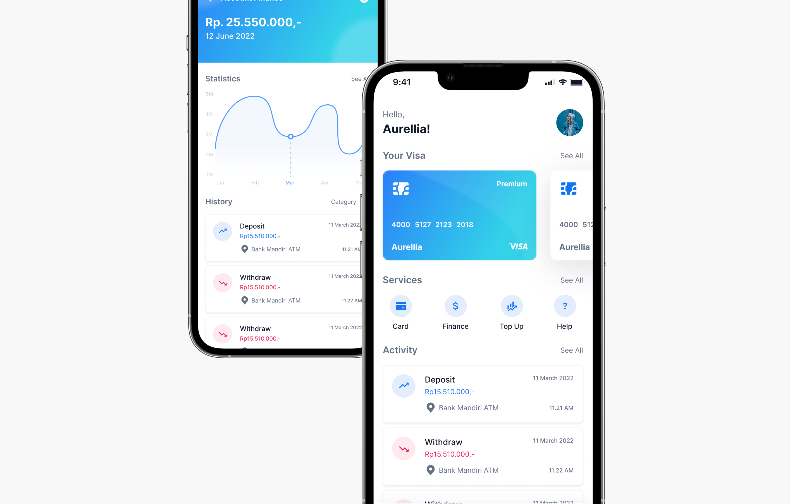

# SkwnFrontendDev-2-FarahFairuz
## Banking App - Modern Financial Dashboard



## 🚀 Live Demo
Visit the live demo at: [https://skwnfrontenddev-2-farahfairuz.vercel.app/](https://skwnfrontenddev-2-farahfairuz.vercel.app/)

## 🛠️ Technologies Used
- React.js
- jQuery
- CSS3
- React Router

## 🏁 Getting Started

### Prerequisites
- Node.js (v14.0.0 or higher)
- npm (v6.0.0 or higher)

### Installation
1. Clone the repository
   ```bash
   git clone https://github.com/farah-bot/SkwnFrontendDev-2-FarahFairuz.git
   cd SkwnFrontendDev-Banking-YourName
   ```

2. Install dependencies
   ```bash
   npm install
   ```

3. Start the development server
   ```bash
   npm start
   ```

4. Open your browser and navigate to `http://localhost:3000`

## 📂 Project Structure
```
├── src/
│   ├── components/       # Reusable UI components
│   ├── pages/            # Home and Finance pages
│   ├── styles/           # CSS styles
│   ├── App.jsx           # Main App component
└── public/               # Public assets
```

## 🚀 Build for Production
```bash
npm run build
```